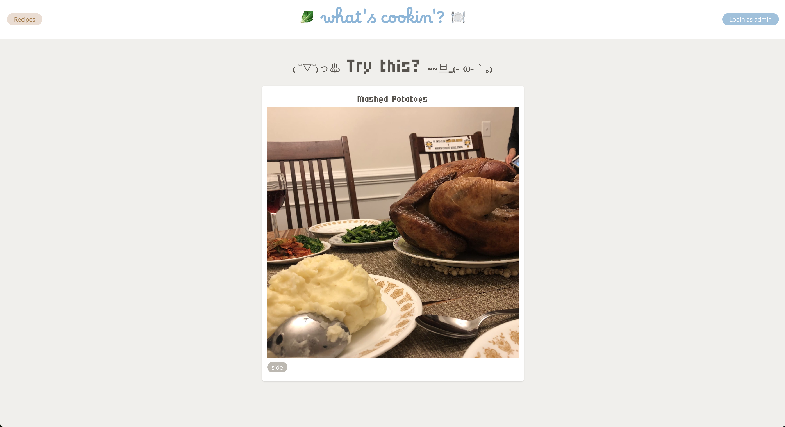
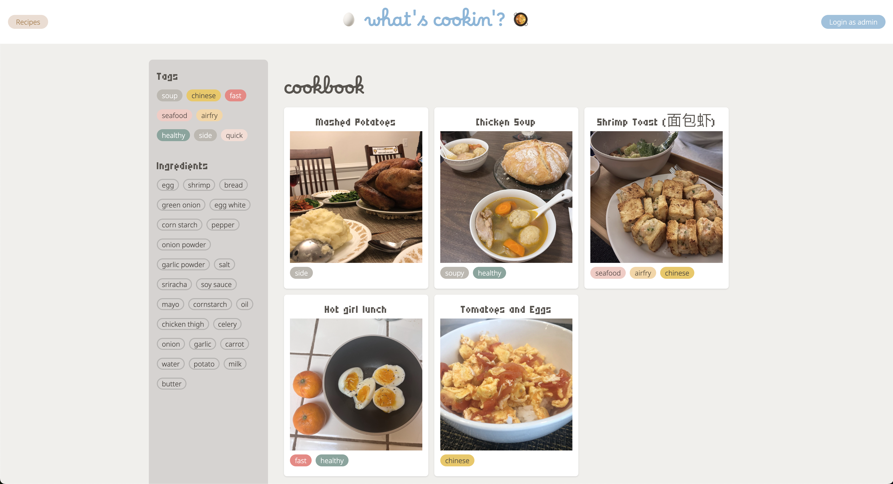
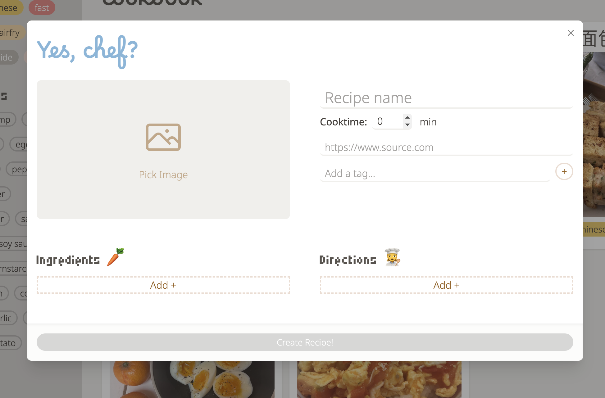
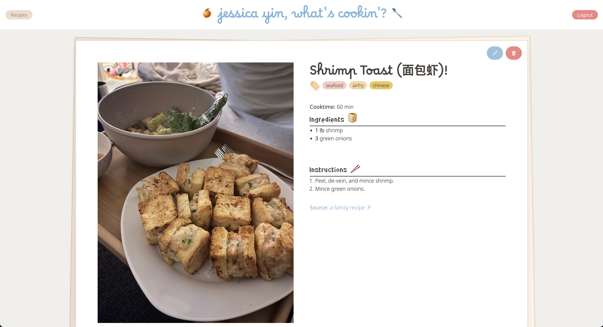

# What's Cookin?

A personal website to keep track of the recipes I love, so I don't need to rack my brain to come up with something every day. Hosted on [GH pages](https://jessyin.github.io/cookin)

## Features
### Random recipe feature
Click "what's cookin" to regenerate.

### List of all recipes
The Tag filter is just for decoration right now xD

### Add / edit recipes
You must be one of the chosen ones to access this feature :3

### View a recipe
For ingredients / instructions. Edit and delete functionality only for the chosen ones as well :P 

## WIP
1. Filter by tags / ingredients
2. Sort by name or date added
3. UI/UX improvements such as drag to re-order directions / ingredients, responsive UI

## Potential future feature additions
4. Upload multiple photos to show recipe process.
5. Maybe a calendar showing what was cooked on which day :^) 

